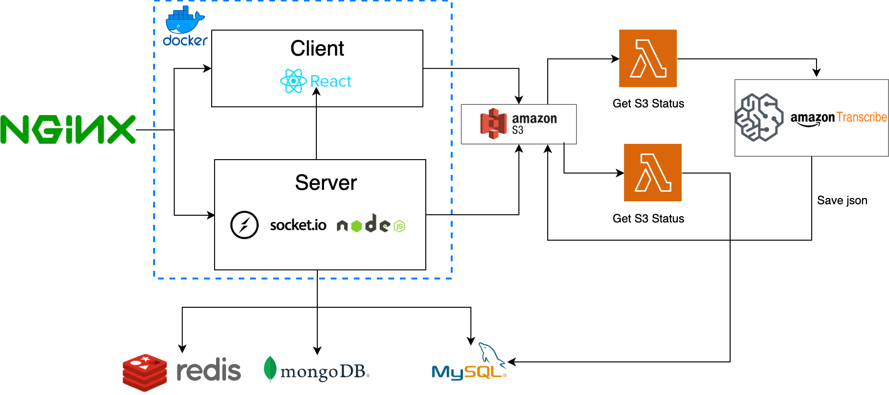
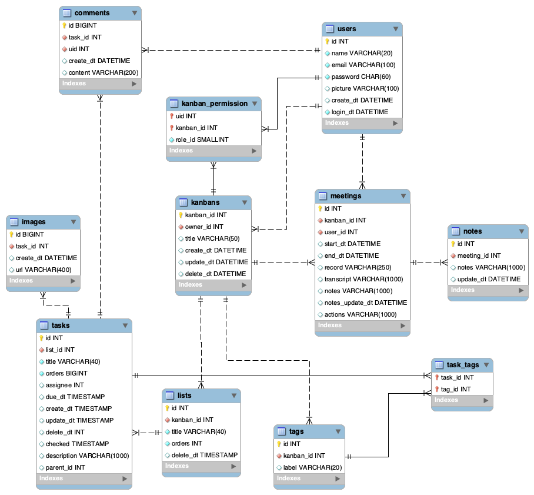

<div align="center">
  <h1> Holala</h1>
  <a href="https://github.com/verazhen/holala/">
    
  </a>

  <p align="center">
    A collaborate task management and meeting tool for remote teams to run project
    <br />
    <a href="https://github.com/verazhen/holala/"><strong>Explore the docs »</strong></a>
    <br />
    <br />
    <a href="https://verazon.online/">View Demo</a>

  </p>
</div>

---
## About Holala  
Holala is a way to work together, a fully functioning task management Web App which has both a minimal and clean UI
that promotes well organized tasking from high rises to the home office.


The App supports features below:
- **personal Task Board:** allows simple and organized task tracking that separates overarching goals or topics from 
specific tasks.
- **Meeting Minute Board:** lists screen recording during the meeting for members to review
- **Report Board:** provides the task progress and member loading for retro


### Tech Stack

- **Client:** React, React MUI, WebRTC

- **Server:** Node, Express, Socket.IO,

- **Cloud Service:** Amazon S3, AWS Lambda, Amazon Transcribe API

- **Database:** MySQL, MongoDB, Redis

- **Environment:** Docker, Docker Compose

---
## Getting Started
The project provides you with 2 install method: git clone, docker-compose, the latter one provides a easier way to install project without Prerequisites.

### 1. Docker-Compose 

#### Prerequisites
- [Install Docker Compose](https://docs.docker.com/compose/install/)

#### Run Docker-Compose
To deploy this project with **container**, you have to proceed follow steps,

1. Download [docker-compose.yml](./docker-compose.yml).
2. Create .env file according to [.env.template](./.env.template)
3. Customize `nginx config`, `redis config` and `.env` folder path in **docker-compose.yml**
4. Run all containers with docker-compose up where you create the .env file.
```bash
docker-compose up -d
```


### 2. Alternative: Git Clone

#### Prerequisites
1. Mysql  
2. MongoDB  
3. Redis  
4. Amazon S3, AWS Lambda, Amazon Transcribe API

#### Installation

1. Clone the project

```bash
  git clone https://github.com/verazhen/Holala
```


2. Go to the project directory and Install server dependencies

```bash
  cd holala
```

```bash
  npm install
```

3. Set up your environment with [.env.example](./.env.example)

4. Start the server

```bash
  npm run start
```

5. Install client dependencies

```bash
  cd src
```
```bash
  npm install
```

6. activate the client with webpack

```bash
  npm start
```
---
## Architecture


---
## Database Schema



---
## Demo

### Kanban Page - Task Management
Lists and tasks are the building blocks of organizing work on a Holala kanban.  

#### Features

- **List Management:** create, rename, and delete lists.
- **Task Management:** create, drag, and delete tasks.

### Kanban Page - Authorization Management
Manage mambers to have the correct level of access to different kanbans.


### Kanban Page - Task Detail Tracker
Tasks are your portal to more organized work—where every single part of your task can be managed, tracked, and shared with teammates. Open any card to uncover an ecosystem of checklists, due dates, attachments, conversations, and more.

#### Features
- Manage deadlines
- Manage tags
- Edit tags
- Provide and track feedback
- Assign tasks and hand off work
- Upload Attachment

### Kanban Page - Chat and Video Conference
The page provides a collaboration space where remote teams can come together, brainstorm, and learn with kanban.

#### Features
- Chat Room
- Video Conference

### Meeting-Minute Page
The page lists all the meeting-minutes record that is automatically generated by the system everytime a meeting is ended

#### Features
- Video Player for Screen Recording
- Transcription for Screen Recording 
- Search feature for transcription 
- Note Editor
- Email Editor and Sender

### Report Page
Visualize progress of the kanban tasks and the loading for each members along with the range and interval interactive filter.  

